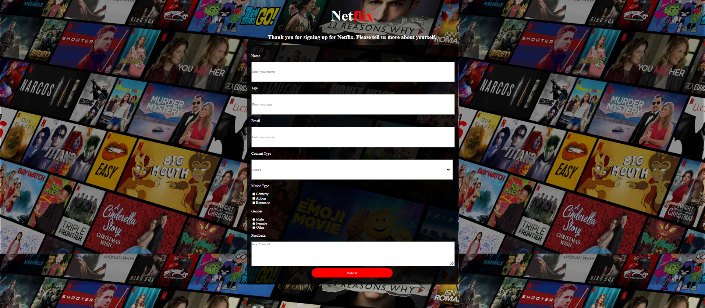

<h1 align="center">Netflix Survey</h1>

  <h3>
    <a href="https://ande-glitch.github.io/homepage/">
      Link to project
    </a>
  </h3>

<!-- TABLE OF CONTENTS -->

## Table of Contents

- [Overview](#overview)
- [Built With](#built-with)
- [Features](#features)
- [How to use](#how-to-use)
- [Contact](#contact)

<!-- OVERVIEW -->
## Overview
A project made with properties consisting of intricate HTML structure and various CSS elements and Flexbox.

### Built With
- [HTML](https://www.w3schools.com/html/)
- [CSS](https://www.w3schools.com/css/default.asp)

## Features
- Netflix color coded
- Working typearea
- Non clickable links
- Functioning background

## How To Use
HTML 
- https://css-tricks.com/snippets/css/a-guide-to-flexbox/
- https://css-tricks.com/snippets/css/a-guide-to-flexbox/
- https://css-tricks.com/snippets/css/a-guide-to-flexbox/
CSS 
- https://css-tricks.com/snippets/css/a-guide-to-flexbox/
- https://css-tricks.com/snippets/css/a-guide-to-flexbox/
- https://css-tricks.com/snippets/css/a-guide-to-flexbox/

## Contact
- GitHub [Ande-Glitch](https://github.com/Ande-glitch)
- Epost [And Nguyen](mailto:andnguyen24@outlook.com)

## Result

## Happy coding!
